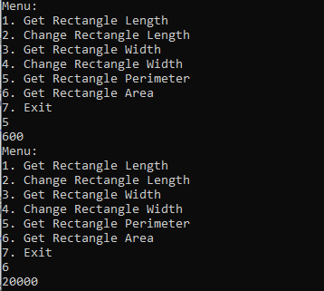

# SQA
A C# console application which allows user to get the perimeter and area of the rectange.  
Developed Unit tests using NUnit for this application. 
The program present the user 7 options:  
1. Get Rectangle Length 
2. Change Rectangle Length 
3. Get Rectangle Width 
4. Change Retangle Width 
5. Get rectangle Perimeter 
6. Get Rectangle Area 
7. Exit  
<b>Screenshots:</b> 
<b>1.</b> 
  
<b>2.</b> 
  
<b>3.</b> 

